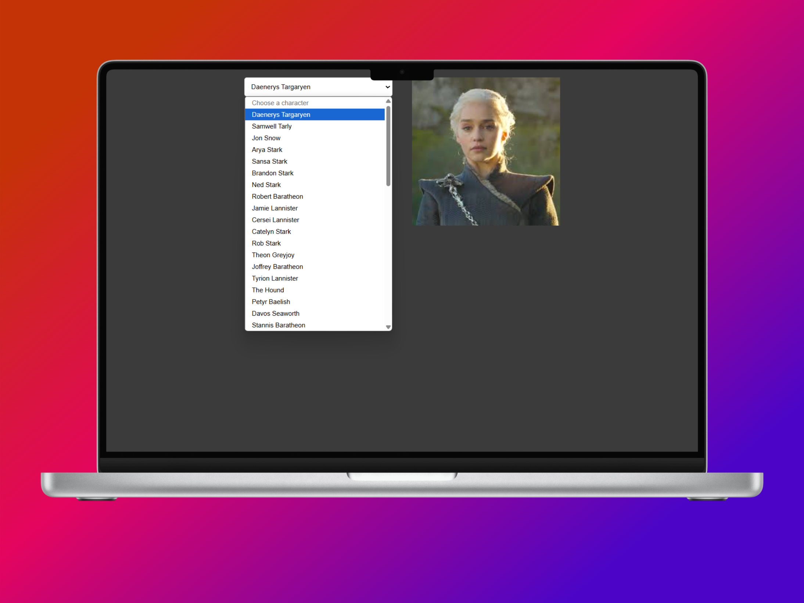

# ejercicios_async_js

📌 Ejercicios de JavaScript Asíncrono

Este repositorio contiene una serie de ejercicios para practicar JavaScript asíncrono utilizando async/await y fetch API.

🚀 Instalación y Uso

Clona el repositorio:

git clone https://github.com/serxa92/ejercicios_async_js.git

Abre cada ejercicio en un navegador o en un entorno como VS Code.

Modifica los archivos .js y experimenta con los conceptos de JavaScript asíncrono.

